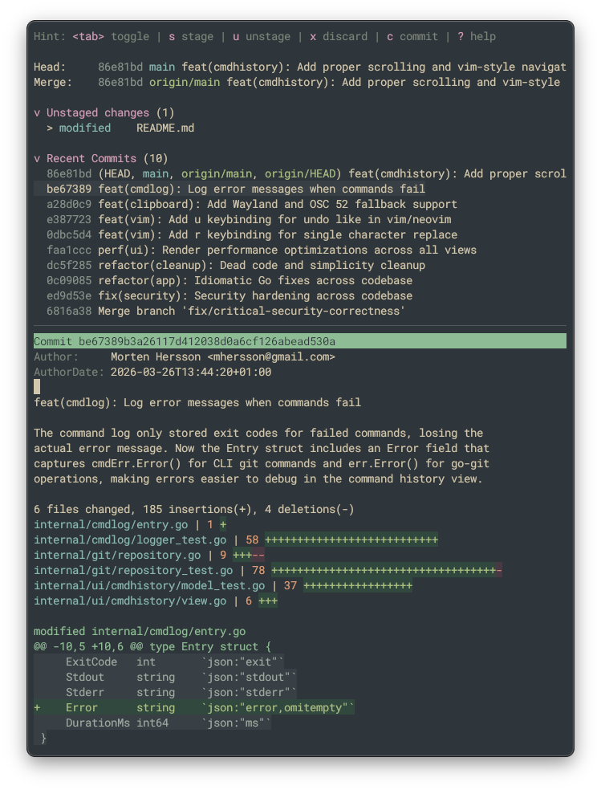

# termagit

A standalone terminal Git UI - a port of
[Neogit](https://github.com/NeogitOrg/neogit). Built with
[Bubble Tea](https://github.com/charmbracelet/bubbletea) and
[go-git](https://github.com/go-git/go-git).

## Why this exists

[Magit](https://magit.vc/) is the best Git interface ever made. When I left
Emacs, [Neogit](https://github.com/NeogitOrg/neogit) filled the gap in Neovim -
but I wanted something editor-agnostic that I could launch from any terminal, in
any project. termagit is that.



> [!NOTE]
>
> This project aims to be a port of Neogit - same look and feel, minus the
> editor integration. The code is written by
> [Claude Code Opus 4.6](https://docs.anthropic.com/en/docs/claude-code). My
> role is specs, prompts, review, and testing.

## Features

- **Full status buffer** with all 12 Neogit sections (untracked, unstaged,
  staged, stashes, recent commits, upstream/push-remote tracking, sequencer,
  rebase, bisect)
- **22 popups** matching Neogit's layout - commit, branch, push, pull, fetch,
  merge, rebase, stash, reset, revert, cherry-pick, tag, remote, diff, log,
  bisect, worktree, ignore, and more
- **Inline diffs** - expand files and hunks directly in the status buffer
- **Hunk-level staging** - stage, unstage, and discard individual hunks; use visual mode (`V`) on diff lines to stage or unstage a custom line range within a hunk
- **Multiple views** - log, reflog, commit detail, refs, stash list, diff,
  command history
- **Commit editor** with (a limited set of) vim keybindings and staged diff
  preview
- **Interactive rebase editor**
- **File watcher** - auto-refreshes when the working tree changes
- **Themeable** - ships with catppuccin-mocha, everforest-dark, and tokyo-night;
  supports custom themes via TOML. _See the [docs](docs/themes.md) for details
  and tips on creating your own!_
- **All Neogit key bindings** - if you know Neogit, you know termagit

> [!WARNING]
>
> This project is in its early stages - expect bugs and missing features. I'm
> using termagit as my daily driver, so I'll be fixing issues and adding
> features as they come up.

## Installation

### From source

```bash
go install github.com/mhersson/termagit/cmd/termagit@latest
```

### Build locally

```bash
git clone https://github.com/mhersson/termagit.git
cd termagit
make build        # binary at bin/termagit
make install      # copies to $GOPATH/bin/
```

Requires Go 1.26+.

## Usage

```bash
termagit                        # open in current directory
termagit -path /path/to/repo    # open a specific repository
termagit -theme everforest-dark # override the color theme
termagit -version               # print version
```

## Editor Integration

### Helix

termagit can be launched from [Helix](https://helix-editor.com/) via
`:insert-output`. Add the following to your Helix `config.toml` to bind
`<Space>gg` in normal mode:

```toml
[keys.normal.space.g]
g = [
    ":write-all",
    ":new",
    ":insert-output termagit",
    ":set mouse false",
    ":set mouse true",
    ":buffer-close!",
    ":redraw",
    ":reload-all"
]
```

This works on macOS and Linux. On Linux, termagit disables the kitty keyboard
protocol inherited from Helix so that ESC and Ctrl-C are sent as standard bytes
rather than CSI u sequences.

## Configuration

termagit uses a TOML config file at `~/.config/termagit/config.toml` (or
`$XDG_CONFIG_HOME/termagit/config.toml`). Missing fields fall back to sensible
defaults - you only need to specify what you want to change.

See [docs/configuration.md](docs/configuration.md) for the full reference with
all options and their defaults.

Quick example:

```toml
theme = "everforest-dark"

[ui]
recent_commit_count = 20

[sections.stashes]
folded = false
```

## Themes

12 built-in themes are available:

Different variants of the following themes are supported (e.g.
`catppuccin-latte`, `catppuccin-frappe`, etc.):

- `catppuccin` (catppuccin-mocha is default)
- `everforest-dark`
- `gruvbox`
- `solarized`
- `tokyo-night`

Custom themes can be placed in `~/.config/termagit/themes/` as TOML files. The
easiest way is to define a palette of ~21 colors - termagit maps them to all UI
elements automatically. See [docs/themes.md](docs/themes.md) for the full guide.

## Key Bindings

termagit uses the same key bindings as Neogit. Here are the essentials:

| Key       | Action                          |
| --------- | ------------------------------- |
| `j` / `k` | Move down / up                  |
| `tab`     | Toggle fold                     |
| `s` / `S` | Stage item / Stage all unstaged |
| `u` / `U` | Unstage item / Unstage all      |
| `x`       | Discard changes                 |
| `Enter`   | Go to file                      |
| `c`       | Commit popup                    |
| `b`       | Branch popup                    |
| `P`       | Push popup                      |
| `p`       | Pull popup                      |
| `f`       | Fetch popup                     |
| `m`       | Merge popup                     |
| `r`       | Rebase popup                    |
| `Z`       | Stash popup                     |
| `l`       | Log popup                       |
| `d`       | Diff popup                      |
| `X`       | Reset popup                     |
| `v`       | Revert popup                    |
| `A`       | Cherry-pick popup               |
| `B`       | Bisect popup                    |
| `t`       | Tag popup                       |
| `w`       | Worktree popup                  |
| `i`       | Ignore popup                    |
| `M`       | Remote popup                    |
| `?`       | Help popup                      |
| `$`       | Command history                 |
| `q`       | Close                           |

### Visual Mode (partial hunk staging)

When the cursor is on a diff line inside an expanded hunk, pressing `V` enters
visual selection mode. This lets you stage or unstage a custom subset of lines
within a hunk.

**How to use it:**

1. Expand a file with `tab`, then expand a hunk (or navigate into hunk lines).
2. Move the cursor onto a diff line (a `+` or `-` line inside the hunk).
3. Press `V` to enter visual mode. The line under the cursor becomes the anchor.
4. Press `j` / `k` to extend the selection up or down.
5. Press `s` to stage only the selected lines, or `u` to unstage them.
6. Press `Esc` to exit visual mode without performing any action.

The selected line range is turned into a minimal unified diff patch and applied
with `git apply`, so the rest of the hunk is left untouched.

## Acknowledgements

- [Magit](https://magit.vc/) - the original and best Git porcelain
- [Neogit](https://github.com/NeogitOrg/neogit) - the Neovim plugin that
  termagit mirrors
- [Bubble Tea](https://github.com/charmbracelet/bubbletea) and
  [Lip Gloss](https://github.com/charmbracelet/lipgloss) - the TUI framework and
  styling library
- [go-git](https://github.com/go-git/go-git) - pure Go git implementation
- [Claude Code](https://docs.anthropic.com/en/docs/claude-code) - wrote all the
  code
